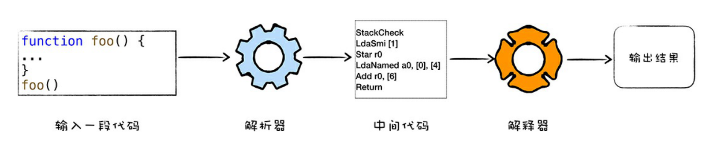
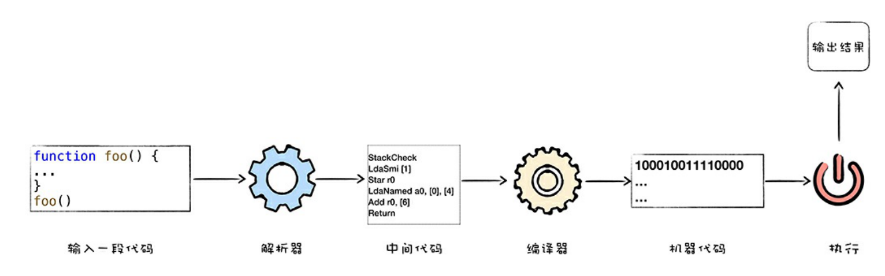
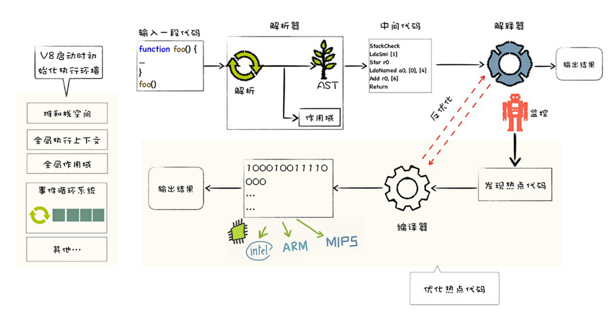

# v8

## What

v8 是 Chrome 开发的一个开源 JavaScript 引擎。

## Why

- 高性能

## How

1. 编译: 首先将 JS 代码转换为低级中间代码或者机器能理解的代码。
2. 执行: 然后执行转换过的代码，并输出结果。

V8 就像一个虚拟机，通过模拟计算机功能来执行代码，如模拟 CPU、堆栈、寄存器等。

### 高级语言为什么要编译再执行

### 为什么要高级语言

## 代码执行方式

1. 解释执行：将源代码通过解析器编译成中间代码，之后再由解释器。

2. 编译执行：将源代码转换为中奖代码，然后编译器再将中间代码转为机器码(通常是以二进制文件形式存储)。

针对不同的高级语言，实现方式有很大差异，比如 C 是直接编译为二进制代码的文件。Java 需要用虚拟机转换执行，JS 需要用 JS 虚拟机转换。

JS 虚拟机种类：

- Safari: JavaScriptCore
- Firefox: TraceMonkey 
- Chrome: V8

## V8 如何执行 JS 代码

1. 混合编译执行
2. 解释执行

JIT(Just in time): 混合使用编译器和解释器的技术。

解释执行：启动快、执行速度慢
编译执行：启动慢、执行速度快

