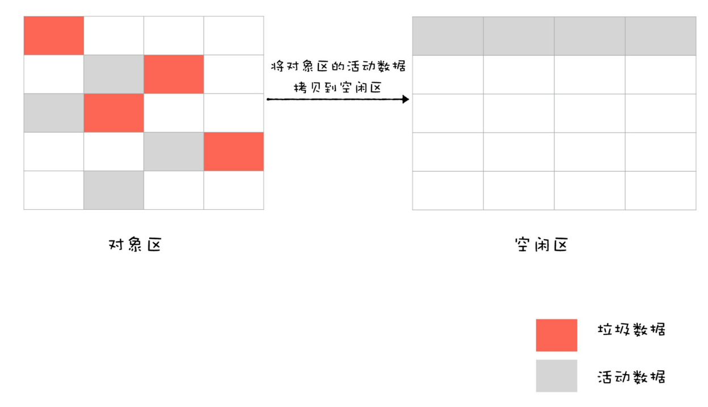
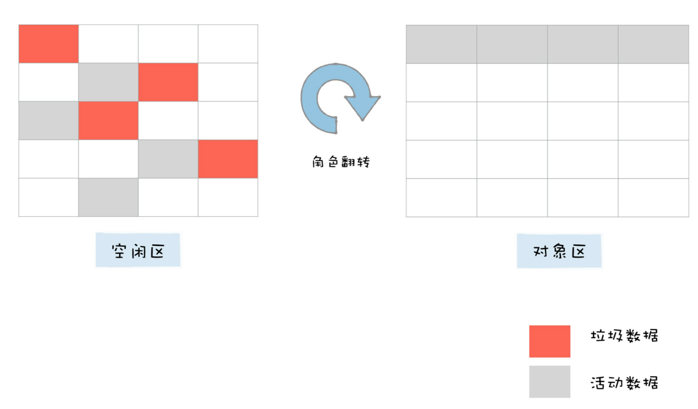
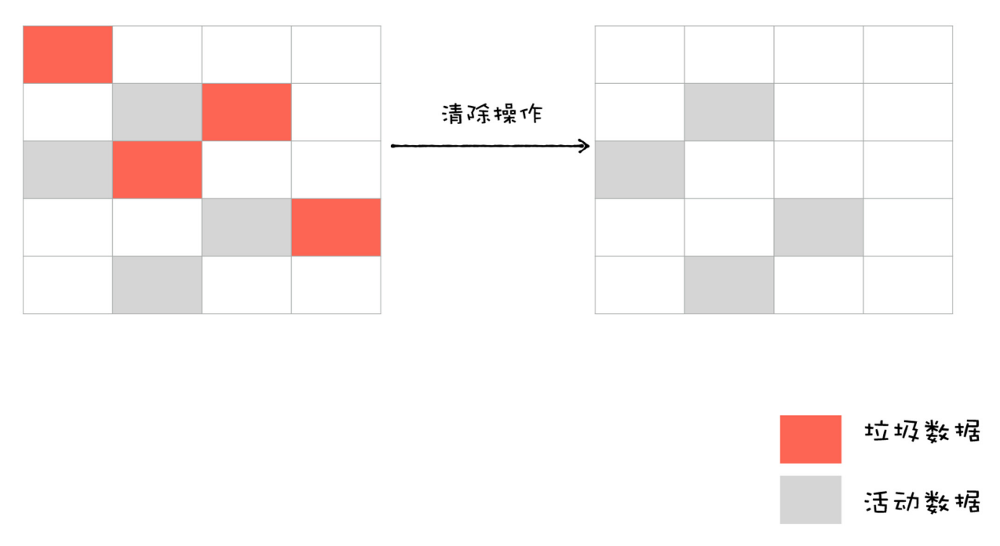
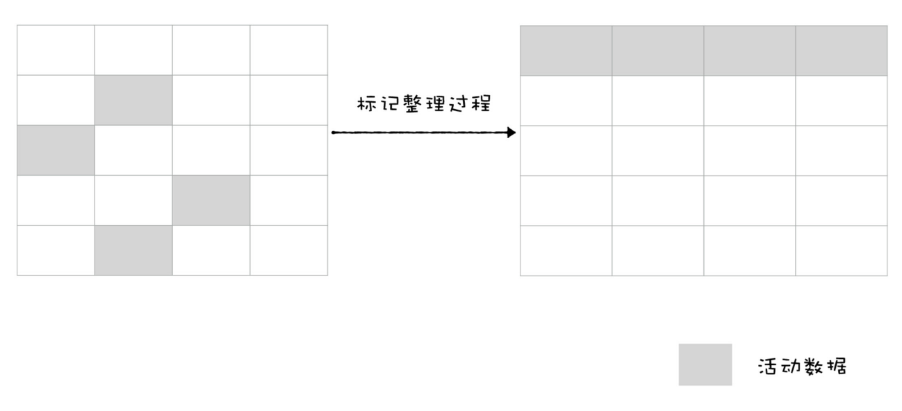
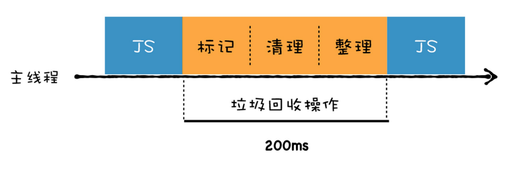
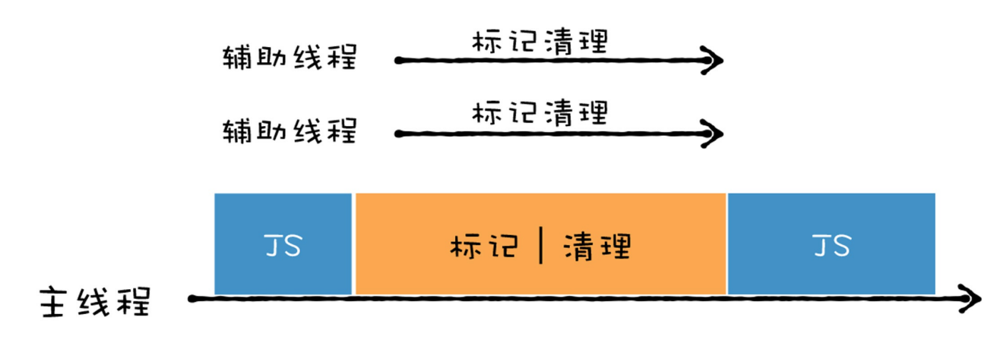
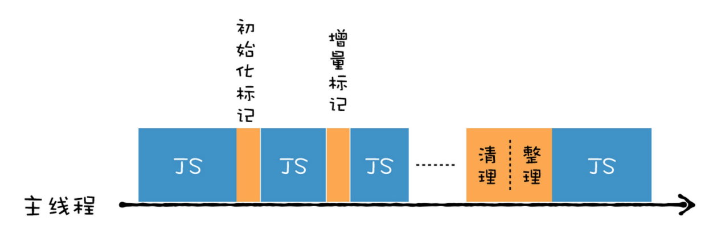
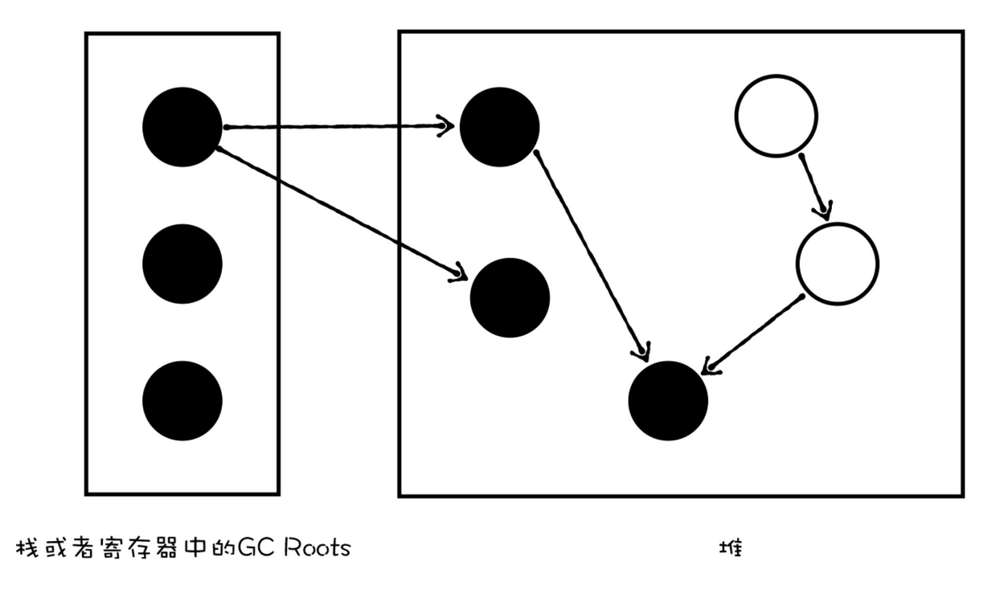
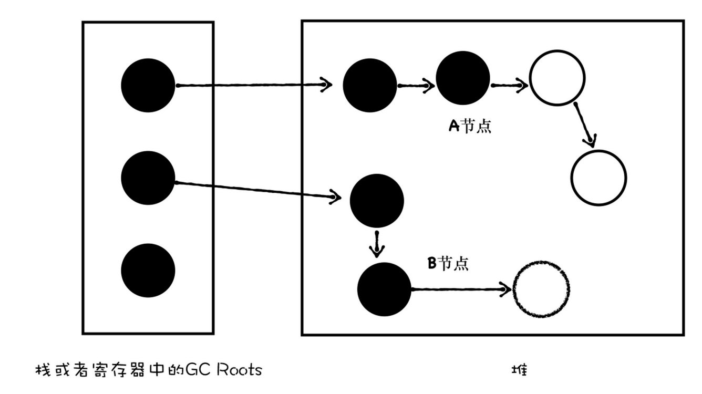

# v8垃圾回收机制

## 垃圾数据是如何产生的

变量如果修改值，原来的值没有被再饮用，它就属于垃圾数据了。

```
window.test.a = []
window.test.a = {}
```


## 垃圾回收算法

**第一步, 通过 GC Root 标记空间中活动对象和非活动对象**

目前 v8 采用可访问性(reachability)算法来推断堆中的对象是否是活动对象。具体就是将一些 GC Root 作为初始存活对象的集合，遍历 GC Root 中的对象。遍历到的就是活动对象，没有遍历到的就是非活动对象。

GC Root 包括(但不止于):

- window(每个iframe中)
- 文档 DOM 树
- 栈上的变量

**第二步, 回收非活动对象，即所有标记完成后，清理可回收对象**

**第三步, 内存整理**

频繁回收对象后，内存中就会有大量不连续空间，即内存碎片。当有大量内存碎片时，如果需要分配较大连续内存，就可能出现内存不足的情况。所以需要整理内存碎片。但这步是可选的，因为有的垃圾回收器不会产生内存碎片。

v8 采用了2个垃圾回收器:主垃圾回收器和副垃圾回收器。 主要是受到代际假说影响。

代际假说：

1. 大部分对象存活时间很短。如函数内的变量。
2. 不死的对象，会活更久。比如 window， DOM, Web API 等对象。

如果只有一个垃圾回收器，在优化大多数新对象时，就很难优化老对象。所以 v8 把堆分为新生代和老生代两个区。新生代存放生存时间短或小的对象（通常只支持1-8MB容量）。老生代存放生存时间长的对象。

- 副垃圾回收器：负责新生代的垃圾回收
- 主垃圾回收器：负责老生代的垃圾回收

## 副垃圾回收器 Minor GC

新生代中垃圾用 Scavenge 算法处理: 把新生代空间对半划分为两个区：对象区(from-space)、空闲区(to-space)

```js
var heap = {
  youngSpace: {}, // 新生区
  oldSpace: {} // 老生区
}

function Scavenge(){
  heap.youngSpace = {
    fromSpace: {},
    toSpace: {},
  }

  // fromSpace 快满了
  if(isFull(fromSpace)){
    minorGC.clean()
  }
}
```

1. 新加入对象会放到对象区，当对象区快满时，就执行垃圾清理。
2. 垃圾回收
   1. 标记对象区垃圾。
   2. 把存活对象复制到空闲区域，并有序排列起来(也就相当于内存整理了)，复制完成后就没有内存碎片了。
   3. 复制完成后，对象区和空闲区角色反转，这样两块区域可以重复利用下去。




由于上面复制过程比较耗时，所以一般新生区空间会设置成比较小。由于比较小，所以很容易满。副垃圾回收器会采用**对象晋升策略**，将移动两次还存活的对象移动到老生代中。

## 主垃圾回收器 Major GC

主垃圾回收器负责老生代中的垃圾回收。来源是：

1. 比较大的对象(会分配到老生代中)
2. 晋升的对象

特点是：大、存活时间长。

如果用 Scavenge 算法，复制会花费很多时间，而且会浪费一半的空间。所以主垃圾回收器采用**标记-清除(Mark-Sweep)**算法，即对垃圾进行标记，然后清除。过程是：

1. 标记阶段，从根元素开始遍历元素，能达到的元素就是活动对象，没有达到的元素就是垃圾数据。
2. 垃圾清除，主垃圾回收器会直接将标记为垃圾的数据清理掉。



上面的问题是，多次执行**标记-清除**算法后，会产生大量内存碎片。所以引入了**标记-整理(Mark-Compact)**算法。过程是：

1. 标记存活对象。
2. 将存活对象都向一端移动。然后直接清理掉这之外的内存。



## 垃圾回收器执行效率

一个完整的垃圾回收，包括标记和清理两个阶段。垃圾回收时，需要暂停主线程 js 脚本。回收完成后，再恢复脚本执行。这叫做全停顿(Stop-The-World)。



由于可能造成卡顿。 v8 给垃圾回收器添加了并行、并发、增量等垃圾回收技术。

1. 将完整的垃圾回收任务拆分为很多小任务。
2. 将标记对象、移动对象等任务转移到后台线程进行。

**并行回收**

引入多个辅助线程并行处理。



采用并行回收时，垃圾回收所消耗的时间，等于总体辅助线程所消耗的时间（辅助线程数量乘以单个线程所消耗的时间），再加上一些同步开销的时间。多个线程速度可能会快，因为不论如何 cpu 都会进行切换。

V8的副垃圾回收器所采用的就是并行策略，它在执行垃圾回收的过程中，启动了多个线程来负责新生代中的垃圾清理操作，这些线程同时将对象空间中的数据移动到空闲区域。由于数据的地址发生了改变，所以还需要同步更新引用这些对象的指针。

**增量回收**

2011 年，v8 引入增量标记的方式。这叫做增量式垃圾回收。

是将标记工作分为更小的块。并且穿插在主线程不同任务之间执行。



增量标记比较复杂，因为它是并发的。需要满足两点:

1. 垃圾回收可以被随时暂停和重启，暂停时需要保存当前的扫描结果，等下次回收来了，才能重启。
2. 暂停期间，被标记的垃圾数据如果被 js 修改了，垃圾回收器需要正确处理。

没有增量标记前。v8 使用黑色和白色来标记数据。执行完一次垃圾回收后，所有数据变为白色，表示未标记。垃圾回收时，会将从 GC Roots 访问到的数据标记为黑色，标记结束后，黑色为活动数据，白色为垃圾数据。



如果内存中的数据只有两种状态，非黑即白，那么当你暂停了当前的垃圾回收器之后，再次恢复垃圾回收器，那么垃圾回收器就不知道从哪个位置继续开始执行了。

比如垃圾回收器执行了一小段增量回收后，被V8暂停了，然后主线程执行了一段JavaScript代码，然后垃圾回收器又被恢复了，那么恢复时内存状态就如下图所示：


